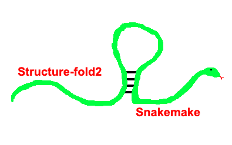

# structure-fold2-snakemake


## Overview
A generalized Snakemake workflow around [StructureFold2](https://github.com/StructureFold2/StructureFold2)
to get reactivities from a Structure-seq experiment. Given
raw/trimmed single-end reads and a transcriptome (or a genome + annotation to
build one), it aligns with Bowtie2, counts RT-stops per replicate, and
calculates per-transcript, per-position reactivity. 

# Running the pipeline
## Setting up the environment

To run this pipeline, you need Snakemake installed. You can create and activate a conda environment 
with containing Snakemake with the following command. 

```
conda env create -f environment.yml
conda activate structure-fold2-snakemake
```
The pipeline itself handles all of the other software dependencies so don't worry about that. 


## Quick start

1. Copy `config/config.yaml`, fill in your samplesheet/transcriptome paths
   (every key is documented inline).
2. Build a samplesheet like `config/samplesheet_example.tsv` (or the
   3-column `config/samplesheet_minimal_example.tsv` if you don't need
   replicate grouping or multi-run concatenation -- see below).
3. `snakemake --sdm conda -j 8 --configfile config/your_config.yaml`


## Samplesheet

Tab-separated, one row per (sample, sequencing run):

| column | required | meaning |
|---|---|---|
| `sample` | yes | sample identifier, matches your FASTQ naming |
| `condition` | yes | exactly `plus` (+DMS/treated) or `minus` (-DMS/untreated) |
| `r1` | yes | path to that (sample, run)'s raw FASTQ |
| `ID` | no | groups samples into biological replicates (e.g. `rep1`) -- a given ID needs both a `plus` and `minus` row somewhere in the sheet, since the reactivity calculation pairs one condition's ID against the other's. **If omitted**, defaults to each sample's row position *within its condition* (`rep1`, `rep2`, ... independently for `plus` and `minus`) -- i.e. the 1st `minus` row pairs with the 1st `plus` row as one replicate, the 2nd with the 2nd, and so on. This assumes equal `plus`/`minus` counts given in matching order; give an explicit `ID` column if that's not your layout. |
| `run` | no | distinguishes multiple sequencing runs of the same sample (e.g. resequenced on a second flow cell); same-sample rows get concatenated before trimming. **Defaults to a single run** if omitted. |
| `temperature` | no | probing temperature for that row (e.g. `30`, `55`, or labels like `low`/`high` -- any two distinct values). **If present**, enables heat correction (`react_heat_correct.py`) between the two temperature groups -- see Outputs below. Every row of a given `ID` must share the same temperature, and exactly two distinct values must appear across the whole sheet. Omit the column entirely to skip heat correction. |


## Outputs (under `output_dir`)

Per replicate ID (the single `pooled` ID under `pool_replicates: both`, or
one `pooled_<temperature>` ID per temperature under `pool_replicates:
both_by_temperature`):
- `{id}/reactivity.react`, `.csv` -- +DMS/-DMS subtracted, 2-8%-normalized reactivity.
- `{id}/coverage.csv`, `{id}/specificity_{plus,minus}.csv`, `{id}/counts_minus.csv` -- per-replicate QC
- `{id}/abundance_{RPKM,TPM}.csv` -- only when `transcript_abundance` lists that mode.
  Relative transcript abundance from the -DMS RT-stop counts (StructureFold2's
  `rtsc_abundances.py`), same rationale as `counts_minus.csv` but normalized to
  RPKM/TPM instead of left as raw counts
- `{id}/3prime_bias_correction/` -- only when `3_prime_bias_correction: true`.
  The +DMS RT-stops of every protein-coding transcript are divided by a
  global 3' coverage-bias model before the reactivity calculation, so
  `reactivity.react` (and heat correction) use the corrected counts. The
  model regresses log(+DMS depth / -DMS depth) on distance from the 3' end,
  relative position and their interaction, fit on one training set shared
  by every ID -- the top `3_prime_bias_n_transcripts` protein-coding
  transcripts by their lowest +DMS coverage across IDs
  (`qc/3prime_bias_correction/training_transcripts.tsv`) --
  with a pooled or per-ID (`3_prime_bias_reference`) -DMS reference. QC:
  `model.tsv` (coefficients, R^2), `coverage_residual_metagene.png`,
  `rtsc_metagene_before_after.png`
- `{id}/p4p6_react*.png` -- only when `positive_control_name: p4p6`
- `{id}/heat_correction/reactivity_<suffix>.react` -- only when the
  samplesheet has a `temperature` column. Follows Su et al. 2018 PNAS SI
  (Materials and Methods, "Determination of DMS reactivity"): first
  restricted to transcripts with RT-stop coverage >= 1 (AC bases) in the
  pooled +DMS samples of BOTH temperatures (`qc/heat_correction_shared_transcripts.txt`),
  then further narrowed to the exact transcript set shared by every
  resulting `reactivity_precorrection.react` (coverage alone doesn't
  guarantee this, since the reactivity calculation itself can still drop a
  transcript per condition -- see `react_intersect_transcripts.py`); each
  transcript's 2-8% percentile normalization scale is computed ONCE from
  the pooled lower-temperature data only (`qc/heat_correction_lower_temperature.scale`)
  and applied to both temperatures, rather than each computing its own
  scale independently (the paper's step 3a/3b -- otherwise the higher
  intrinsic DMS reactivity at the higher temperature partly renormalizes
  itself away); finally rescaled onto a common overall-signal scale (the
  paper's step 4) to correct for any remaining temperature-dependent
  reactivity difference (suffix configurable via `heat_correction_suffix`
  in `config/config.yaml`)

Pipeline-wide, under `qc/`: alignment stats, replicate correlation (when
there's more than one replicate), base specificity, and (when a positive
control is configured) its alignment-%. `covered_transcripts_upset_replicates.png`
-- an UpSet plot of transcripts with RT-stop coverage >= 1 in each TRUE
biological replicate -- is produced whenever there's more than one replicate,
always on the real per-replicate coverage regardless of `pool_replicates`.
When `pool_replicates` merges replicates into a different, still-multi-set
grouping (`both_by_temperature`/`minus_all_plus_by_temperature`; plain
`both` collapses to a single set, which can't be UpSet-plotted),
`covered_transcripts_upset_merged.png` is additionally produced over that
merged grouping. `transcript_position_annotations.csv`
(5UTR/CDS/3UTR + codon position per transcript position) is produced whenever
`genome` + `annotation_gtf` are set.

## Example

`tests/heat_ambient_full/` is a complete, real run you can point to for
what the outputs actually look like: all 12 samples from
`config/samplesheet_rice_heat_ambient.tsv` (3 replicates x plus/minus x
ambient/heat), full FASTQs (no downsampling), cutadapt trimming, and a
`gffread` transcriptome -- run with `tests/heat_ambient_full/run_test.sh`
(or `run_test_cluster.sh` to submit each job to SLURM instead of running
locally).

Alignment stats (`qc/alignment_stats_summary.tsv`):

| sample | total_reads | unique_mapped_pct | multi_mapped_pct | overall_alignment_pct |
|---|---|---|---|---|
| S1_ambient | 57,396,292 | 59.16 | 7.70 | 66.86 |
| S4_ambient | 66,231,085 | 63.09 | 9.16 | 72.24 |
| S1_heat | 48,340,689 | 52.25 | 7.76 | 60.02 |
| S4_heat | 57,980,355 | 59.00 | 9.39 | 68.38 |

`{id}/reactivity.csv`:
```
transcript,position,base,reactivity
Os01t0100100-01,1,G,NA
Os01t0100100-01,2,T,NA
```

The `temperature` column triggers heat correction: 10,201 transcripts
passed the coverage threshold shared by both temperatures
(`qc/heat_correction_shared_transcripts.txt`), and
`qc/heat_correction_scale_factors.log` reports the two correction factors
applied to bring ambient and heat onto a common scale:
```
Higher temp values to be scaled by factor: 0.951013924003
Lower temp values to be scaled by factor: 1.0543066116
```

And the RT-stop metagene plot (`qc/metagene/metagene_rtsc.png`, one line
per sample, dashed = -DMS):


## Testing

`tests/` has a separate, self-contained Snakemake pipeline that downloads a
real (subsampled) public Structure-seq2 dataset and transcriptome, runs
this pipeline against them end-to-end, and sanity-checks the results:

```
snakemake --sdm conda -j 8 -s tests/Snakefile
```

Run from the repo root. See `tests/README.md` for what data it uses, what
"passing" actually checks, and expected runtime/disk usage (it's a real
integration test against ~12 million reads, not a quick unit test).
